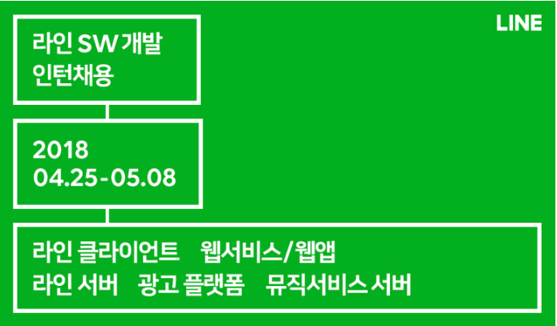
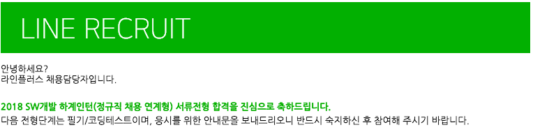

> 2018.05.18 23:44
# LINE 2018 SW개발 하계인턴 - 정규직 채용 연계형 지원하다

## 기대
대학 생활 하면서 인턴쉽 생활을 꼭 해보고싶었는데 마침 좋은 기회가 있어서 지원을 해봤다. 
솔직히 말하면 개발자의 길로 가고싶다는 생각을 갖고 실천한게 얼마 되지 않았다.
한 반년?
길다면 길지만 정말 쉬지않고 달렸기때문에 나의 실력을 테스트해보고싶었던 순간이었다.

## 서류전형 합격
1차는 서류전형이었는데 글을 잘 못쓰는 나에게 있어서 정말 힘들었지만 최선을 다해 작성을 하니 진심이 녹았나보다.

**결과는 1차 서류전형합격이었다!**

필기 / 코딩테스트의 시험이 남았다. 솔직히 내일인데 긴장되서 글을 쓰고있다. 알고리즘 공부보다는 이제까지 문법 공부들과 웹 공부를 전념하고있던터라 항상 코딩테스트에 약한 내 모습을 볼 수 있었다.
저번에 '프로그래머스' 에서 진행한 여름방학 인턴쉽 코딩테스트에서 안좋았기 좀 더 두려운 순간이다.

목표는 1차 서류전형 합격이었지만 정말로 라인에 첫 발을 디딜 수 있는 기회가 주어져 욕심이 생겼다. 만약에 이번 코딩테스트를 계기로 떨어진다면 조금 더 발전해야할 필요성이 있다.
설령, 떨어지더라도 낙심하지말고 1차 서류전형 붙은것에 의미를 갖고 조금 더 실력을 갈고 닦아야겠다.
