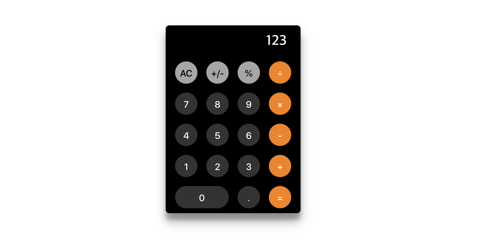

# Vue.js 를 이용한 계산기
#### [Github Repository](https://github.com/heecheolman/Study/tree/master/2018-07-14/vue-calc)
#### [Live Demo](https://heecheolman.github.io/vue-calculator/)

## Preview


## 소개
[Vue.js](https://kr.vuejs.org/v2/guide/index.html) 를 익히기 위해 연습삼아 만들어본 계산기 입니다. 더불어 `eval()` 함수를 쓰지 않고 스택 자료구조를 이용하여 진행했습니다. Live Demo 를 통해 체험해 보실 수 있습니다. 디자인은 아이폰의 기본 계산기 앱을 모방했습니다.


## 특징


#### 스택을 이용한 계산
* `oprStack` 과 `numStack` 이라는 배열의 `push()` 와 `pop()` 을 사용
* 연산자 우선순위에 의해 스택에 쌓이고 계산할지 계산하고 쌓을지 결정합니다.

  * 연산자 우선순위가 높을경우 현재 들어온 값에 대해 계산을 먼저 실행하고 결과값이 스택에 쌓입니다.
  * 연산자 우선순위가 낮을경우 스택에 쌓여져있는 것들을 계산한 후에 다시 스택에 쌓입니다.

* 연산자 우선순위는 다음 코드가 결정해줍니다. (% 를 나머지연산으로 착각해서 그만...)
  * 연산자가 아닌 데이터는 숫자이므로 우선순위를 제일 낮게 설정해주었습니다.
```javascript
getPriority(data) {
      switch(data) {
        case '×':
        case '%':
        case '÷':
          return 2;
        case '+':
        case '-':
          return 1;
      }
      return -1;
    }
```

#### 사용된 뷰 컴포넌트
**`<view-content>`**  
계산기의 계산된 결과를 보여주는 계산기에서의 화면입니다.

**`<button-content>`**  
계산기 내의 버튼들에 대한 컴포넌트입니다. 각 버튼들에대한 데이터는 `buttonList` 가 가지고있습니다.  
조건부 클래스 바인딩을 통해 클래스를 버튼별로 다르게 주었습니다.


## 배운점
* vue.js 기본 문법
* vue.js 클래스 및 스타일 바인딩
* 스택 자료구조를 이용한 계산기 구현
* 컴포넌트에 props 전달

## 참고

[Vue.js: Why Components’ Data Properties Must Be Functions -  Bo Andersen](https://codingexplained.com/coding/front-end/vue-js/why-components-data-properties-must-be-functions)
